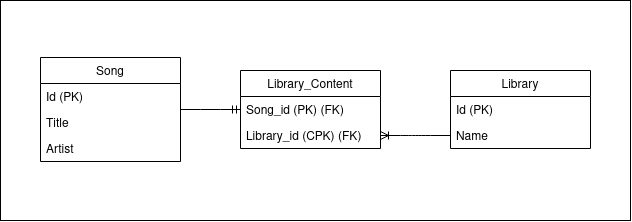

# TL;DR

A project that focuses on Spring Data JPA (Java Persistence API) and Spring HATEOAS (Hypermedia as the Engine of Application State).


<br />

# Why did I do this?

To practice how to create backend applications using Spring Framework with Spring Boot again.

# What is this?

A simple `Song Library Application` with 3 tables.

- Song
- Library
- LibraryContent

Users can create a library and songs. They can also add songs in the library via the LibraryContent table.

### Simple ERD


# How to run the application?

There are 2 ways to run this:

1. Install PostgreSQL in your computer and use the code below in the application.properties in `/main/resources/` folder.

```
spring.datasource.url=postgresql://localhost:5432/<your database name>
spring.datasource.username=<your postgres username>
spring.datasource.password=<your postgres password>
spring.jpa.hibernate.ddl.auto=create-drop
```

2. Install `docker` and `docker-compose` and run the command below. This will create 2 containers, the maven and postgres containers.
```
docker-compose up
```

# How to test the application?

I've included a postman collection to make it easy. Just run these request to test the application.

Routes:

- `/songs`  [GET, POST]
- `/songs/{id}` [GET, PUT, DELETE]
- `/libraries` [GET, POST]
- `/libraries/{id}` [GET, PUT, DELETE]
- `/libraries/content/{id}` [GET]
- `/libraries/content/{id}/song/{song_id}` [GET, DELETE]

